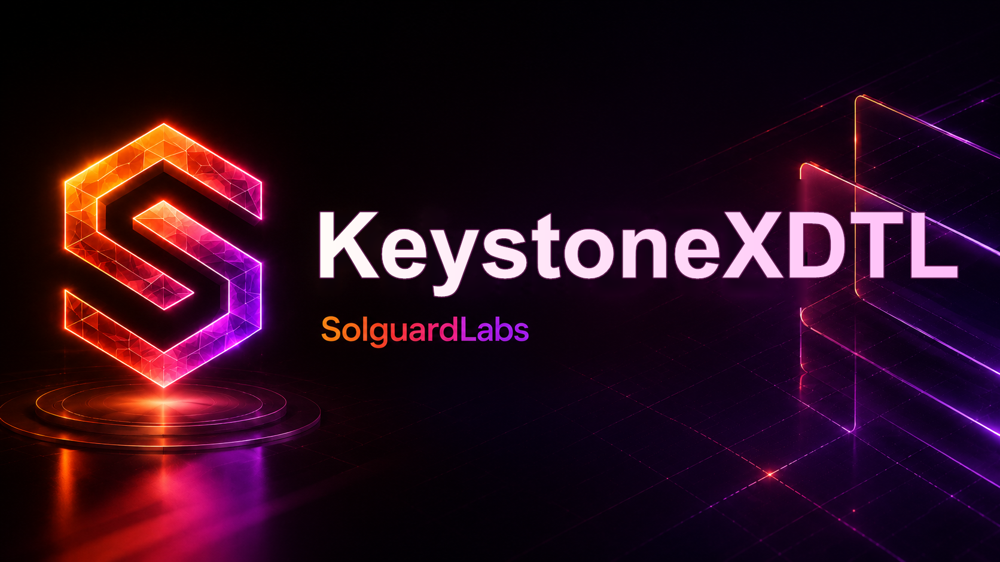

# Keystone XDTL



Keystone XDTL es un motor Rust para prestamos internos entre vaults DTL. Modela
un conjunto de bovedas que pueden aportar liquidez, tomar credito temporal,
bloquear colateral, repagar deuda, entrar en default, ser liquidadas y
redistribuir intereses realizados entre participantes del vault.

El repositorio esta construido como un nucleo de protocolo auditable: entidades
tipadas, IDs deterministas, journal de eventos, oraculo local, politicas de
riesgo, contabilidad de vaults, analitica de cartera y escenarios CLI
serializados en JSON para pruebas de contrato.

## Componentes principales

- `amount`: unidades enteras, shares, bps y conversiones de precio.
- `ids`: IDs canonicos de cuenta, asset, vault, loan, posicion y transaccion.
- `vault`: contabilidad de deposits, redenciones, colateral, deuda e ingresos.
- `loan`: terminos, schedule, quotes de repago y estados de ciclo de vida.
- `engine`: aplicacion atomica de operaciones entre vaults, journal e invariantes.
- `liquidation`: calculo de close factor, bonus, shortfall y recuperacion.
- `policy`: modelos de interes, colateral, limites y tiers de riesgo.
- `oracle`: libro de precios local para valor conservador de activos.
- `accounting`, `risk`, `portfolio`: vistas auxiliares para revision y monitoreo.
- `scenario` y `runtime`: escenarios reproducibles usados por los tests JS.

## Flujos soportados

- Registro de vaults por rol: liquidez, prestatario, hibrido y tesoreria.
- Depositos con emision de shares segun NAV del vault.
- Apertura de prestamos internos con colateral y schedule.
- Repagos programados, anticipados y parciales.
- Marcado de default despues de vencimiento y periodo de gracia.
- Liquidacion parcial con close factor y actualizacion de exposiciones.
- Distribucion de intereses realizados a holders del vault.
- Reportes JSON deterministas para integracion con suites externas.

## Requisitos

- Rust 1.96 o superior.
- Node.js 24 o superior para los tests de contrato JS.
- Bash para ejecutar los scripts de CI local en entornos Unix-like.

## Uso

Listar escenarios disponibles:

```bash
cargo run --quiet -- list
```

Ejecutar un escenario:

```bash
cargo run --quiet -- loan
cargo run --quiet -- repayment
cargo run --quiet -- prepayment
cargo run --quiet -- default
cargo run --quiet -- liquidation
cargo run --quiet -- redistribution
```

Cada escenario imprime un `ScenarioReport` JSON con aliases de vaults y
cuentas, operaciones relevantes, eventos, balances agregados, digest de estado y
resultado de invariantes.

## Tests

Tests Rust:

```bash
cargo test --locked
```

Tests JavaScript contra el CLI:

```bash
node --test "tests/node/*.test.js"
```

Suite completa:

```bash
bash scripts/ci.sh
```

En Windows tambien se puede ejecutar manualmente:

```powershell
cargo fmt --all -- --check
cargo build --all-targets --locked
cargo test --locked
cargo clippy --all-targets --all-features --locked -- -D warnings
node scripts/check-js.mjs
node --test "tests/node/*.test.js"
```

## Estructura

```text
src/                 Nucleo Rust del protocolo
tests/helpers/       Helpers JS para ejecutar escenarios
tests/node/          Tests de contrato y flujos
scripts/             Validaciones locales
.github/workflows/   CI de GitHub Actions
.vscode/             Configuracion de editor
```

## Estado

Keystone XDTL es un lab de auditoria local. No depende de red, RPC, wallets ni
servicios externos. Las cifras se expresan como unidades enteras del activo
nativo del lab.
